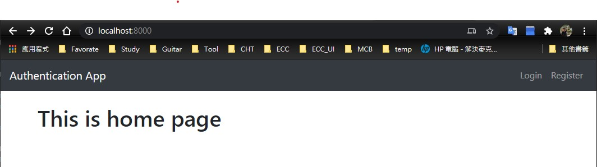
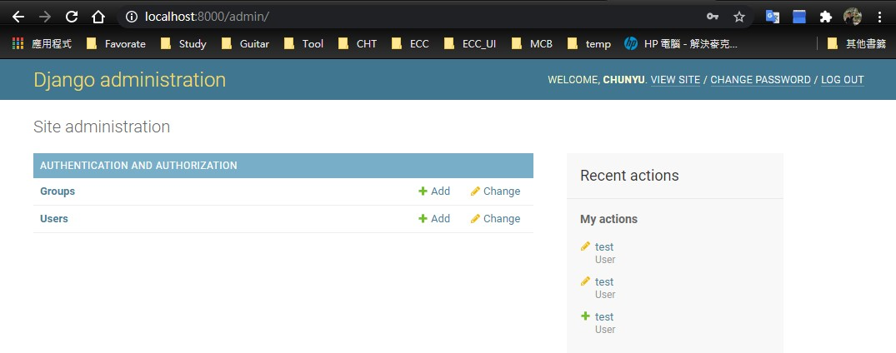
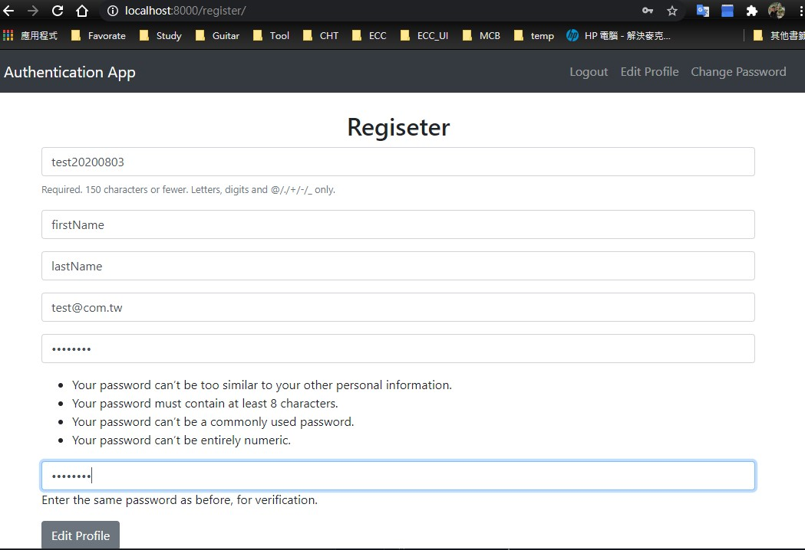
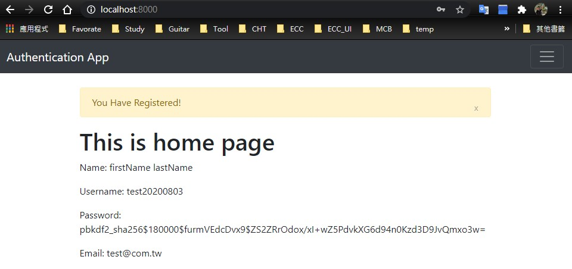

# 透過以下步驟 可以建立 Django 的 Restful api 服務， 專案說明 : 
參考 : https://www.udemy.com/build-a-user-authentication-web-app-with-python-and-django/learn/v4/overview

此專案有包含 template html 實作 Loing In Page 網頁登入的操作。

程式內 authenticate, login, logout, update_session_auth_hash 使用到的都是 Django 內建的涵式.  Django 強大的框架提供了很多實作的方法. 

# 執行專案專案步驟 : 
### 進入 pythn virtualenv
PS D:\workspace\Django-auth-Pratice> .\Scripts\activate
### 啟動 app
(Django-auth-Pratice) PS D:\workspace\Django-auth-Pratice> python .\manage.py runserver
### 離開 env 
$ ./deactivate


# 專案從無到有步驟 : 

### 安裝 pythone 3.7

### 進入 django 工作資料夾
    $ cd .\django-project\   

### 安裝虛擬環境
    $ pip install virtualenv

### 建立虛擬環境。 會產生 /Scripts/ 資料夾
```
PS D:\workspace\Django-auth-Pratice> virtualenv .
created virtual environment CPython3.7.8.final.0-64 in 2705ms
  creator CPython3Windows(dest=D:\workspace\Django-auth-Pratice\Scripts, clear=False, global=False)
  seeder FromAppData(download=False, pip=bundle, setuptools=bundle, wheel=bundle, via=copy, app_data_dir=C:\Users\jerry\AppData\Local\pypa\virtualenv)
    added seed packages: pip==20.1.1, setuptools==49.0.1, wheel==0.34.2
  activators BashActivator,BatchActivator,FishActivator,PowerShellActivator,PythonActivator,XonshActivator
 ```

### 啟動虛擬環境
```
打開 PowerShell 使用 administrator 權限執行 
PS C:\WINDOWS\system32> Set-ExecutionPolicy Unrestricted
執行原則變更
執行原則有助於防範您不信任的指令碼。如果變更執行原則，可能會使您接觸到 about_Execution_Policies 說明主題 (網址為
https:/go.microsoft.com/fwlink/?LinkID=135170) 中所述的安全性風險。您要變更執行原則嗎?
[Y] 是(Y)  [A] 全部皆是(A)  [N] 否(N)  [L] 全部皆否(L)  [S] 暫停(S)  [?] 說明 (預設值為 "N"): y

PS D:\workspace\Django-auth-Pratice\Scripts> .\activate
(Django-auth-Pratice) PS D:\workspace\Django-auth-Pratice\Scripts> 
```
### 虛擬環境內安裝 django
    $ pip install django

### 建立專案 "my_site"
    $ mkdir my_site
    $ cd .\my_site\
    $ django-admin.py startproject mysite .

### 啟動 server 
    $ python .\manage.py runserver

### db migrate
    $ python .\manage.py migrate			

### 建立一個 admin 的 user
    $ python .\manage.py createsuperuser		

### 建立 app : authenticate
    $ python .\manage.py startapp authenticate	

### 建立資料夾 templates 放 app 的所有 網頁  
    ~\my_site\authenticate\templates\    

###  建立資料夾 templates\authenticate 放 app 的 authenticate 網頁  
 ```
 $ ls ~\my_site\authenticate\templates\authenticate\ 	 
Mode                LastWriteTime         Length Name
----                -------------         ------ ----
-a----       2020/7/2  下午 03:03           3319 base.html
-a----       2020/7/2  下午 03:03            894 change_password.html
-a----       2020/7/2  下午 03:03           1003 edit_profile.html
-a----       2020/7/2  下午 03:03            335 home.html
-a----       2020/7/2  下午 03:03            599 login.html
-a----       2020/7/2  下午 03:03            923 register.html
 ```
 
 #### 瀏覽 http://localhost:8000
http://localhost:8000/


 #### 瀏覽 http://localhost:8000/admin
http://localhost:8000/admin


 #### 瀏覽 http://localhost:8000/register
http://localhost:8000/register




 #### 瀏覽 http://localhost:8000/login
http://localhost:8000/login


### 程式說明 :  
mysite\  : 主程式

authenticate :  app

### mysite\setting.py :  設定 app(authenticate) 設定 app(authenticate)
``` 
INSTALLED_APPS = [
    'django.contrib.admin',
    'django.contrib.auth',
    'django.contrib.contenttypes',
    'django.contrib.sessions',
    'django.contrib.messages',
    'django.contrib.staticfiles',
    'authenticate'
]
```

### mysite\urls.py : 註冊 view fucntin 的 url path 
```
urlpatterns = [
    path('admin/', admin.site.urls),
    path('', include('authenticate.urls')),
]
```

###  authenticate\urls.py : 設定 path 對應的 view .
````
from django.urls import path
from . import views
urlpatterns = [
    path('', views.home, name="home"),
    path('login/', views.login_user, name="login"),
    path('logout/', views.logout_user, name="logout"),
    path('register/', views.register_user, name="register"),
    path('edit_profile/', views.edit_profile, name="edit_profile"),
    path('chang_password', views.change_password, name='change_password'),
]
````

### authenticate\views.py : 定義 view  接收到 reqeust 後處理的行為，行為處理後最後通常是 render 或是 redirect 到 html 。
```
from django.contrib.auth import authenticate, login, logout, update_session_auth_hash

def login_user(request):
    if request.method == 'POST': 
        username = request.POST['username']
        password = request.POST['password']
        user = authenticate(request, username=username, password=password)
        if user is not None:
            login(request, user)
            messages.success(request, ('You Have Been Logged In!'))
            return redirect('home')
        else:
            messages.success(request, ('Error Logging In! Please Try again!'))
            return redirect('login')
    else:
        return render(request , 'authenticate/login.html', {})
```

### authenticate\templates\login.html
```




<h2 class="text-center"> Login </h2>

<div class="col-md-6 offset-md-3">
    <form method="POST">
        
        <div class="form-group">
          <input type="text" class="form-control"  placeholder="Enter Username" name="username">
        </div>
        <div class="form-group">
          <input type="password" class="form-control" placeholder="Password" name="password">
        </div>
        <button type="submit" class="btn btn-secondary">Login</button>
      </form>
    </div>
 
```


當中 register_user, edit_profile 用所謂的 automatic 方法，使用 Django 內建的 UserCreationForm & UserChangeForm 
from django.contrib.auth.forms import UserCreationForm, UserChangeForm
automatic 會把所有 form validation 都做完了。只要遵循方法她就會用正確的方式把 register 跟 edit user 做好。
```
from .forms import SignUpForm, EditProfileForm

def register_user(request):
    if request.method == 'POST':
        #form = UserCreationForm(request.POST)
        form = SignUpForm(request.POST)
        if form.is_valid():
            form.save()
            username = form.cleaned_data['username']
            password = form.cleaned_data['password1']
            user = authenticate(request, username=username, password=password)
            login(request, user)
            messages.success(request, ('You Have Registered!'))
            return redirect('home')
    else: 
        #form = UserCreationForm()
        form = SignUpForm()

    context = {'form': form}
    return render(request , 'authenticate/register.html', context)

def edit_profile(request):
    if request.method == 'POST':
        #form = UserChangeForm(request.POST, instance=request.user)
        form = EditProfileForm(request.POST, instance=request.user)
        if form.is_valid():
            form.save()
            messages.success(request, ('You Have Edited Your Profile!'))
            return redirect('home')
    else: 
        #form = UserChangeForm(instance=request.user)
        form = EditProfileForm(instance=request.user)

    context = {'form': form}
    return render(request , 'authenticate/edit_profile.html', context)
```

form.py : 作者透過 form.py overlap(overwrite)做原本 django 提供 form 的客製化動作
```
from django.contrib.auth.forms import UserCreationForm, UserChangeForm
from django.contrib.auth.models import User
from django import forms


class EditProfileForm(UserChangeForm):
    password = forms.CharField( label="", widget=forms.TextInput(attrs={'type':'hidden'}))

    class Meta:
        model = User
        fields = ('username', 'first_name', 'last_name',  'email', 'password',)

class SignUpForm(UserCreationForm):
    email = forms.EmailField(label="", widget=forms.TextInput(attrs={'class':'form-control', 'placeholder':'Email Address'}))
    first_name = forms.CharField( label="", max_length=100, widget=forms.TextInput(attrs={'class':'form-control', 'placeholder':'First Name'}))
    last_name = forms.CharField(label="", max_length=100, widget=forms.TextInput(attrs={'class':'form-control', 'placeholder':'Last Name'}))

    class Meta:
        model = User
        fields = ('username', 'first_name', 'last_name',  'email', 'password1', 'password2')

    def __init__(self, *args, **kwargs):
        super(SignUpForm, self).__init__(*args, **kwargs)

        self.fields['username'].widget.attrs['class'] = 'form-control'
        self.fields['username'].widget.attrs['placeholder'] = 'User Name'
        self.fields['username'].label = ''
        self.fields['username'].help_text = '<span class="form-text text-muted"><small>Required. 150 characters or fewer. Letters, digits and @/./+/-/_ only.</small></span>'

        self.fields['password1'].widget.attrs['class'] = 'form-control'
        self.fields['password1'].widget.attrs['placeholder'] = 'Password'
        self.fields['password1'].label = ''

        self.fields['password2'].widget.attrs['class'] = 'form-control'
        self.fields['password2'].widget.attrs['placeholder'] = 'Confirm Password'
        self.fields['password2'].label = ''
```


---
ref: 

無法透過 vscode 安裝 pylint plug-in (因為是在虛擬環境內 ) 所以在命令列裡面 

$ pip install pylint

正常程序開啟 vscode pylint 會報錯 要用 console 執行  $ code
